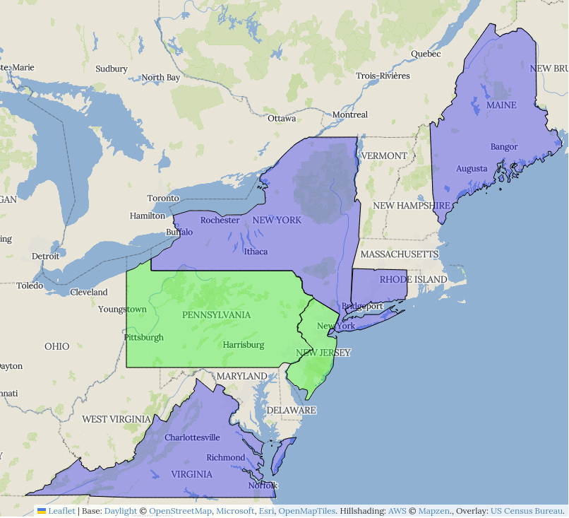

# Local Geohistory Project

## Mission Statement

The Local Geohistory Project aims to educate users and disseminate information concerning the geographic history and structure of political subdivisions and local government.

## Resources Available

The project makes many resources available for other researchers, including:

* The application code that runs the [Local Geohistory Project website](https://www.localgeohistory.pro/), including the scripts used to create the base map tiles.
* The open data presented on the Local Geohistory Project website.
* State law indexes, mostly digitized and reformatted from analog works, which will be used for further expansion of the project.
* A conversion script for [Atlas of Historical County Boundaries](https://digital.newberry.org/ahcb/) data, along with the converted data, which simplified its import into [OpenHistoricalMap](https://www.openhistoricalmap.org/).

Release files are also stored on [Zenodo](https://zenodo.org/communities/localgeohistoryproject), which assigns DOIs to each repository and release to facilitate citation.

### Status Map

**Blue** signifies that a law index is available for the jurisdiction.

**Green** signifies that Local Geohistory Project open data is available for the jurisdiction.
